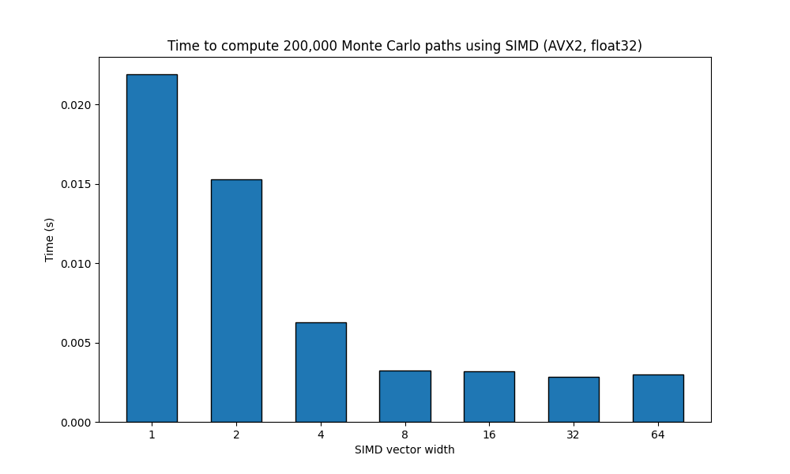
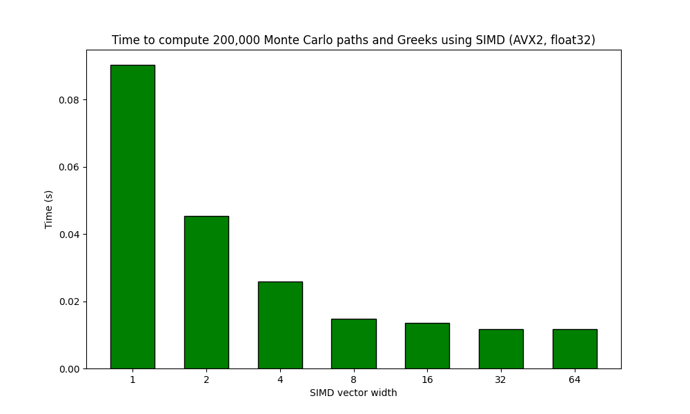

# Option Pricing, Risk and Volatility Modelling

This repository contains some of the code I developed as part of my master's thesis which studied the use of Adjoint Automatic differentiation (AAD) for calculating the Greeks on options priced using Monte Carlo under the Black Scholes model. It explores the benefits of vectorised computations for this task and shows the speedup that can be gained.

[My implementation of AAD](autodiff) uses a Tape structure to hold Nodes representing mathematical operations carried out in the program. This is a simple way of representing a computation graph DAG and is all abstracted behind the Number interface. Calculating adjoints is as easy as performing the backpropagation algorithm to accumulate them using the chain rule.

I thought the [Mojo]() programming language might be well suited to this task as it provides easy access to SIMD primitives which compile to CPU-native instructions.

As an extension to these initial results, I implemented a simply SVI volatility model and calculated the sensitivities of its parameters using AAD.

## Speeding up Monte Carlo Option Pricing

I priced a vanilla European call using the Black Scholes model and 200,000 Monte Carlo paths across weekly time steps for the sake of complexity. The test was ran on a Ryzen 9 5900x which supports AVX2, so theoretically has space for eight 32-bit floats in its registers. The actual speed up achieved is **6.7x**.




## Fast Risk

Optimisations such as pathwise adjoints [2] are implemented to reduced memory consumption and improve performance. Similar overall performance improvemetns can be seen when pricing the European option and calculating the first-order Greeks (Delta, Rho, Theta, Vega). A maximum **8.1x** speed up is achieved here. This is the theoretical maximum that can be achieved on this processor and is due to the fact that the computational overhead of AAD slows the program down enough to escape potential I/O bottlenecks.



This simulation with adjoint calculations exhibits a 3-4x slow down which matches the upper bound given in [4].

## Some Volatility Modelling and Sensitivities

### SVI

The first local volatility model is a simple one - SVI. In [apple.ipynb](apple.ipynb) the current Apple stock call options data from yfinance are used to fit the SVI parameters $a$, $b$, $\rho$, $\sigma$ and $m$. There parameters are then used in [euro_call_svi.mojo](euro_call_svi.mojo) to price a European Call option of strike 220 with Monte Carlo using the SVI calculated volatility to find the first-order Greeks as well as the SVI parameter sensitivities. The correctness of the price and Greeks can easily be checked with an [online tool](https://quantpie.co.uk/inp/inp_bsm_price_greeks.php).

<!-- ```
Price:  29.50482177734375
Delta:  0.64890378713607788
Theta:  19.051700592041016
Rho:    86.219757080078125

SVI params sensitivities:
a:      169.47048950195312
b:      1087.1392822265625
rho:    -0.32143396139144897
m:      0.24952980875968933
sigma:  0.0038893709424883127
``` -->


|Param|Analytical Value|MC+AAD Value|
|-----|----------------|----------------|
|Price|29.5669|29.5048|
|$\Delta$|0.6487|0.6489|
|$\theta$|-19.1122|-19.0517|
|$\rho$|86.1373|86.2198|


|SVI param|Sensitivity|
|-----|----------------|
|a|169.44705|
|b|1087.1393|
|$\rho$|-0.3214|
|m|0.2495|
|$\sigma$|0.0039|

### Local Volatility

Dupire local vol WIP
<!-- To really showcase the beenfits of AAD, a local volatility model is used and all X local vega values are calculated in only Yx the time it takes to evaluate the primal Monte Carlo simulation. -->

## References

[1] Gatheral, J. and Jacquier, A. (2013) ‘Arbitrage-free SVI volatility surfaces’, Quantitative Finance, 14(1), pp. 59–71.
[2] Giles, M.B., & Glasserman, P. (2005). Smoking Adjoints: fast evaluation of Greeks in Monte Carlo calculations.
[3] Savine, Antoine. (2019). Modern Computational Finance : AAD and Parallel Simulations. 1st edition. Hoboken, New Jersey: Wiley.
[4] Griewank, A., & Walther, A. (2000). Evaluating derivatives - principles and techniques of algorithmic differentiation, Second Edition. Frontiers in applied mathematics.